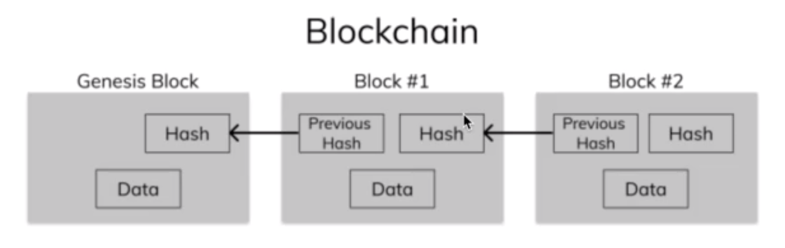

# Build a Blockchain Project

## Specs

- Blockchain is a reversed linked list
- Proof of work

The overall goal was to build a blockchain that resembles this model:

## Reversed Linked List

Unlike a linked list where we would keep a reference to the root node and each node has a next property,
we keep a reference to the end node and each node has a previous property.

The value of previous is the hash of the previous node. 

Each node is referenced as a hash, not an object, except for the end node, which is indeed an object.

## Proof of Work

Each miner of a block will generate a hash for the previous block. Once the hash for the previous block meets the target difficulty, the current block is mined and added to the blockchain.

(The current block is not hashed at the moment it is added to the blockchain. Only the previous block is hashed.)

## Future Plans

### Transactions

- Add fake transactions to each block
    - Ideally store the transactions in a proper data structure.

### Peer to Peer Network

- Have multiple miners trying to mine the current block
    - Each miner will have to use a different algorithm to generate their nonce's
    - Once a miner finds a hash that meets the target difficulty:
        - The block mined will be verified by checking that the data in the block is correct and the nonce used meets the target difficulty.
        - All miners will reset and try to mine the next block.

## Questions

- I feel like a have somewhat of an idea of how data is stored in the blockchain, but I dont understand how the data is retrieved.
    - I don't understand because all the data is hashed, and since hashing is a one way operation, how will the hash be used to read information such as transaction history and account balances?